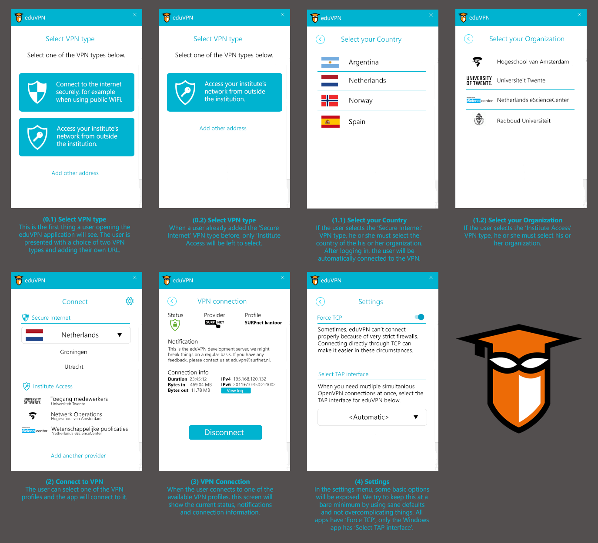

# Styling version 3
This is the third iteration of the app and UI styling in the eduVPN project.

## General impression

## Use cases
The styling is intended for all eduVPN applications. Currently this means the eduVPN for Windows and eduVPN for Android clients. We are also working on MacOS, iOS and Linux.

## Behaviour
* On first use, the user is presented the 'Choose your profile' screen. 
* When at least one profile has been previously added, the user will see the 'Connect' screen where he/she can connect to the previously added profile or add another (new profile) to the list.
* When the user already has Secure Internet Profiles loaded, the 'Choose your profile' screen will only show the 'Institute Access' and 'Add another address' buttons as shown in `0-select-profile-access-only.png`.

# Guidelines
## Windows
* The font used is Segoe UI.

## Android
* The font used is Open Sans.

This page will be elaborated at a later point. For more information about the styling, please look at the Styling version 2 [requirements document](https://github.com/eduvpn/documentation/tree/master/app/windows).
